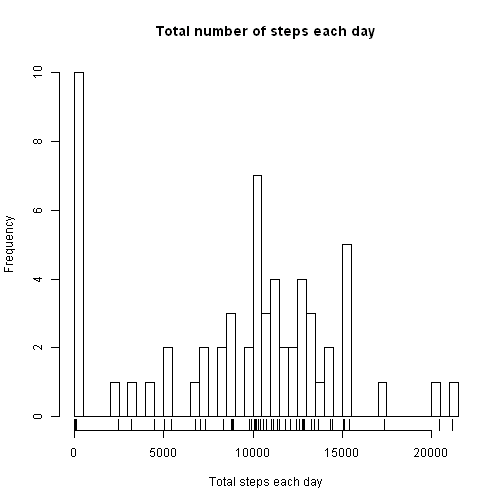
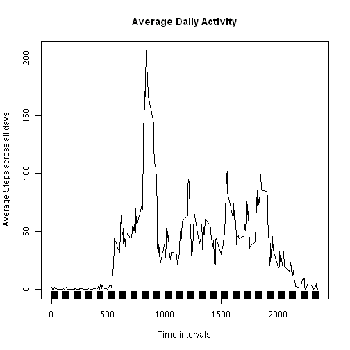
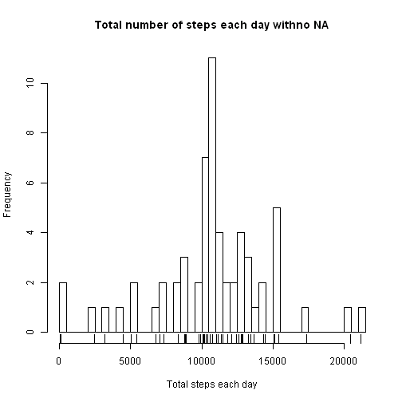
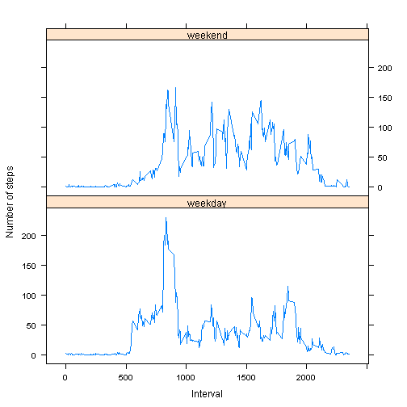

# Reproducible Research: Peer Assessment 1


## Loading and preprocessing the data
*1.Load the data from csv file;*

```r
# if file remains unzipped, unzip it. Note, the activity.zip file should be
# at the working directory already at least to run below script
# successfully.
if (!file.exists("activity")) {
    unzip("activity.zip", exdir = "activity")
}

dataSet <- read.csv("activity/activity.csv")
```

* Let's peer at this dataset, get a knowledge of how it looks like.


```r
summary(dataSet)
```

```
##      steps               date          interval   
##  Min.   :  0.0   2012-10-01:  288   Min.   :   0  
##  1st Qu.:  0.0   2012-10-02:  288   1st Qu.: 589  
##  Median :  0.0   2012-10-03:  288   Median :1178  
##  Mean   : 37.4   2012-10-04:  288   Mean   :1178  
##  3rd Qu.: 12.0   2012-10-05:  288   3rd Qu.:1766  
##  Max.   :806.0   2012-10-06:  288   Max.   :2355  
##  NA's   :2304    (Other)   :15840
```

```r
head(dataSet)
```

```
##   steps       date interval
## 1    NA 2012-10-01        0
## 2    NA 2012-10-01        5
## 3    NA 2012-10-01       10
## 4    NA 2012-10-01       15
## 5    NA 2012-10-01       20
## 6    NA 2012-10-01       25
```

```r
tail(dataSet)
```

```
##       steps       date interval
## 17563    NA 2012-11-30     2330
## 17564    NA 2012-11-30     2335
## 17565    NA 2012-11-30     2340
## 17566    NA 2012-11-30     2345
## 17567    NA 2012-11-30     2350
## 17568    NA 2012-11-30     2355
```

*2.Process data into suitable formats for different analysis.*
* Sum up the steps by each day, and make a new dataset subSet1

```r
subSet1 <- dataSet[, c(1, 2)]
library(plyr)
subSet1 <- ddply(subSet1, .(date), summarize, steps = sum(steps, na.rm = T))
```

* Calculate the mean of steps across all days by each time interval, and make a new dataset subSet2

```r
subSet2 <- dataSet[, c(1, 3)]
subSet2 <- ddply(subSet2, .(interval), summarize, msteps = round(mean(steps, 
    na.rm = T), 2))
```


## What is mean total number of steps taken per day?
*1.Make a histogram of the total number of steps taken each day:*


```r
hist(subSet1$steps, main = "Total number of steps each day", xlab = "Total steps each day", 
    breaks = 50)
rug(subSet1$steps)
```

 


*2.Calculate the mean and median total number of steps taken per day*


```r
meanStepsPerD <- mean(subSet1$steps, na.rm = T)
medianStepsPerD <- median(subSet1$steps, na.rm = T)
```

**The mean total number of steps taken each day is 9354.2295.**
**The median total number of steps taken each day is 10395.**

## What is the average daily activity pattern?
*1.Make a time series plot of the 5-minute interval (x-axis) and the average number of steps taken, averaged across all days (y-axis):*


```r
plot(subSet2$msteps ~ subSet2$interval, main = "Average Daily Activity", type = "l", 
    ylab = "Average Steps across all days", xlab = "Time intervals")
rug(subSet2$interval)
```

 


*2.According to the above plot, we can easily find out that the maximum number of steps across all days is among the interval range 800 ~ 900, based on the following calculation:*


```r
maxInterval <- subSet2[subSet2$msteps == max(subSet2$msteps, na.rm = T), ]
```

**We can accuratly locate the maximum value is in interval 835.**

**Also, based on the plot shown as ablove, as a daily activity pattern, we can see that, generally the object becomes active from 5am and through the whole day till approximately 21pm, and between 8am and 9am, the object takes the highest steps through out the day.**

## Imputing missing values
*1.Calculate and report the total number of missing values in the dataset*


```r
tNA <- as.numeric(sum(is.na(dataSet$steps)))
```

The total number of missing values in the dataset is 2304.

*2.Use the mean total steps of the specific 5-min interval across all days to fill in the missing data of the corresponded interval each day.*


```r
# make a copy of the original dataset.
dataSet2 <- dataSet
for (i in 1:nrow(dataSet2)) {
    if (is.na(dataSet2[i, ]$steps)) {
        NAinter <- dataSet2[i, ]$interval
        fillValue <- round(subSet2[subSet2$interval == NAinter, ]$msteps, 0)
        dataSet2[i, ]$steps <- fillValue
    }
}
```


*3.Make a histogram of the total number of steps taken each day and Calculate and report the mean and median total number of steps taken per day. Let's see if any change comparing to the datasets without NA filling:*


```r
# Sum up the steps by each day, and make a new dataset subSet3
subSet3 <- dataSet2[, c(1, 2)]
library(plyr)
subSet3 <- ddply(subSet3, .(date), summarize, steps = sum(steps, na.rm = T))

# Make a histgraph of total steps:
hist(subSet3$steps, main = "Total number of steps each day withno NA", xlab = "Total steps each day", 
    breaks = 50)
rug(subSet3$steps)
```

 

```r

# calculate the mean and median total steps of each day.
meanStepsPerD2 <- mean(subSet3$steps)
medianStepsPerD2 <- median(subSet3$steps)
```


As calculated, the mean total steps of each day for the new dataset **with** NAs filled in is 1.0766 &times; 10<sup>4</sup>, while the median value of it is 1.0762 &times; 10<sup>4</sup>. By comparing to the original dataSet **without** NAs filled in values(mean = 9354.2295, median = 10395), we found out that the new mean and median steps were both increased.

## Are there differences in activity patterns between weekdays and weekends?
*1.Create a new factor variable in the dataset with two levels - "weekday" and "weekend" indicating whether a given date is a weekday or weekend day.*


```r
# add a factor variable in dataSet2, this new variable will indicate the
# date whether weekday or weekend.
dataSet2$weekday <- weekdays(as.Date(dataSet2$date, "%Y-%m-%d"), abbreviate = T)
dataSet2$week <- ifelse(dataSet2$weekday == "Sat" | dataSet2$weekday == "Sun", 
    "weekend", "weekday")
dataSet2 <- transform(dataSet2, week = as.factor(week), weekday = NULL)
```


*2.Make a panel plot containing a time series plot of the 5-minute interval (x-axis) and the average number of steps taken, averaged across all weekday days or weekend days (y-axis):*


```r
# process dataSet2, compute the average steps for each 5-min interval across
# all weekdays or weekends.
subSet4 <- dataSet2[, c(1, 3, 4)]
subSet4 <- ddply(subSet4, .(interval, week), summarize, msteps = round(mean(steps), 
    2))

# plot using lattice package
library(lattice)
windows()
xyplot(msteps ~ interval | week, data = subSet4, layout = c(1, 2), type = "l", 
    xlab = "Interval", ylab = "Number of steps")
```

 


**By viewing the above plots, we can see that, generally in the weekend mornings, the object becomes active 2 or 3 hours latter than weekdays, and during weekends, by average, the object didn't take more than 200 steps each 5-min interval through out the day, which means no obvious faster pace through out the day, but the object moves more frequently than during weekdays. While during weekdays, the object rises much earlier than weekend, and approximately during 8:30 and 9:00, the object walks much more frequently and fater than other hours during the day. In the end, looks like the object doesn't have much activity after 10pm, probably go to bed the same time each day, good habit!**
